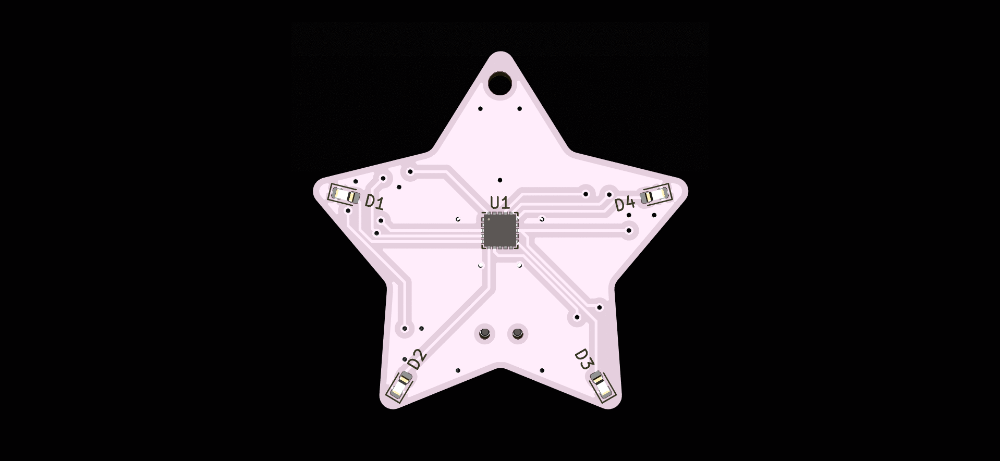

# star-earrings

PCB earrings to show the world that you are there!

## Features

- 4 bright white LEDs
- Mode changing push button
- On/Off Switch
- CR1220 battery life estimated at 570 hours (40mAh/0.07mA)
- Open-source hardware and software allow customizable LED patterns

## Design Considerations

- As light weight as possible -> 0.8mm PCB Thickness
- Balance battery weight/life -> CR1220 Button Cell Battery
- Bright LEDs -> PWM controlled to avoid inline resistor
- Minimal aesthetic -> UFQFPN20 microcontroller footprint
- Power Saving -> STM32L011U6
- No loss of battery while in storage -> Slide switch for on/off
- Mode changing -> Push Button to switch LED patterns
- SMD Manufacturing/Assembly -> 100% SMD Components with dual side panelized assembly

## Fimrware

The firmware for the earrings uses the open-source [libopencm3](http://libopencm3.org/) library

- TIM2 used for PWM
- TIM21 used for LED pattern changing interrupt
- EXTI4 Interrupt used for push button
- LPTIM1 used for button debounce

